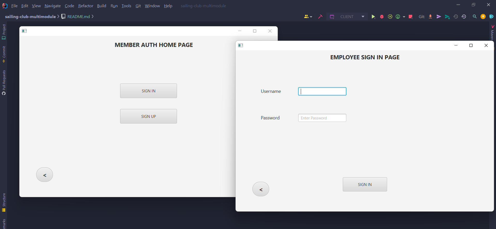

# Sailing Club Project

This is a client-server application written in Java using module features introduced in Java 8.
It also uses Maven for project management.

Javadoc is available at `/sailing-club-multimodule/src/main/resources/javadoc/index.html`.

Tests of base classes are available at `/sailing-club-multimodule/backend/src/test/java/entities/`.

### Table of Contents

- [Project Structure](#project-structure)
- [Prerequisites](#prerequisites)
- [Setup](#setup)
- [How to run the application](#how-to-run-the-application)

## Project Structure

The application is divided in two modules:
- `backend`: contains the server logic
- `frontend`: contains the JavaFX application

Each module uses the folder structure and conventions suggested by Maven,
while also having dependencies such as JavaFX and MySQL managed by it.

### DAO Pattern

We used the Data Access Object (DAO) pattern to abstract away details of the persistence layer.
The domain layer, instead of interacting directly with the database, communicates with the DAO layer,
which in turn communicates with the persistence layer. The advantage of this approach is that,
if a change in the persistence layer is needed, only the DAO layer will be changed.

### Client-Server communication

Clients and server communicate via two classes exposed to the frontend
using Java 8 module features:

- `Message`: used to send a request from client
- `Reply`: used to send a reply from server

To avoid creating huge switch-case statements the **Command Pattern** was used in the server
code to handle all the different request types sent by clients. This enables us to have more
readable code and to have for each request a particular class.

## Prerequisites
- This application uses MySQL as the DBMS which is not provided from the project, and
  thus should be already installed in the host machine
- Eclipse or IntelliJ should have been already installed with the latest JDK
- JavaFX should be already installed and setup in the host environment

## Setup
> :warning: **The following scripts will erase a database named sailing-club if it already exists in the host machine**
- Execute the `createProductionDB.sql` script situated in
  `/sailing-club-multimodule/backend/scripts/createProductionDB.sql` to create the database
  - Install Maven dependencies in your IDE of choice

    ### In Intellij
      - go to `Run -> Edit Configurations`
      - add two configurations for `Server.java` and `Client.java` with
        `Add new Configuration`
      - for `Client.java` `Modify Options -> Enable multiple instances` to be
        able to run multiple clients at the same time

      ### Eclipse
        
    #### Import project
    
    - on top menu -> `File` -> `Import`
    - click `Maven` -> `Existing Maven projects`
    - click `Browse`
    - choose the correct path in your system for `sailing-club-multimodule` project

    #### Run configuration
    On top menu -> `Run` -> `Run Configuration`

      #### Server
    - click on `Java Application`
    - click `Add new configuration`
    - rename it `Server`
    - in `project` -> click `browse` -> choose `backend`
    - in `main class` -> click `search` -> choose `serverManagement.Server`
    
    #### Client
    - click on `Java Application`
    - click `Add new configuration`
    - rename it `Client`
    - in `project` -> click `browse` -> choose `frontend`
    - in `main class` -> click `search` -> choose `com.sailingclub.frontend.Client`

## How to run the application
There are two entry points to run the application:
- `sailing-club-multimodule/backend/src/main/java/serverManagement/Server.java`: to start the server
- `sailing-club-multimodule/frontend/src/main/java/com/sailingclub/frontend/Client.java`: to start
  JavaFX application

> :warning: **`Server.java` should always be started before `Client.java`**

1. Execute `Server.java`
2. Execute `Client.java`, this class can be started multiple times concurrently